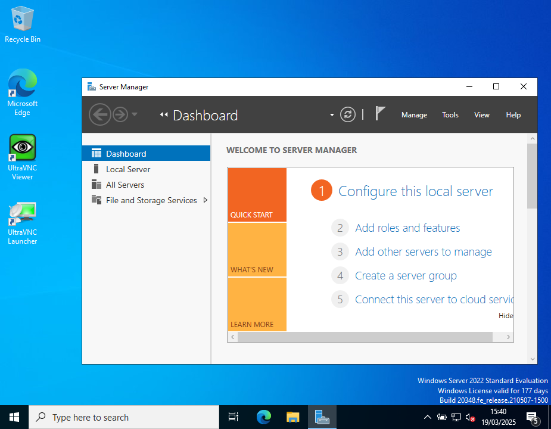

## Sommaire

1. [Prérequis technique](#prerequis-technique)
2. [Installation sur le serveur](#installation-sur-le-serveur)  
   a. [Renommer le pc](#renommer_le_pc)  
   b. [Configuration réseau](#configuration_reseau_serveur)  
   c. [Installation Ultra VNC](#installation_ultra_vnc_server)  
   d. [Désactivation du pare-feu](#desactivation_du_pare_feu_serveur)  
   e. [Droits d'accès](#droits_acces_serveur)  
4. [Installation sur le client](#installation-sur-le-client)  
   a. [Réseau VirtualBox](#virtualbox_reseau)  
   b. [Configuration réseau](#configuration_reseau_client)  
   c. [Installation Ultra VNC](#installation_ultra_vnc_client)  
   d. [Désactivation du pare-feu](#desactivation_du_pare_feu_client)  
   e. [Droits d'accès](#droits_acces_client)  
6. [FAQ](#faq)

# **Projet Réalisé sur machines virtuelles**        

# 1. Prérequis techniques

- Un Hyperviseur de type 1, dans notre cas = [**Oracle VirtualBox 7.1.6**](https://www.virtualbox.org/wiki/Downloads)
- Serveur = **Windows Server 2022** / Client = **Windows 10 Pro** ou Ultérieur

# 2. Installation sur le serveur 

   **a. Renommer son PC**  

Lorsque vous vous connectez au mode administrateur, le Server Manager s'affiche:  

**ETAPE 1** : Cliquez en haut à gauche sur le nom du PC en bleu (ex: WinServ)  

**Etape 2** : Une nouvelle fênetre s'ouvre, cliquez sur le bouton "change" :

**Etape 3** : Dans "Computer Name" taper le nouveau nom du PC (ex: SRVWIN01)

**Etape 4** : Cliquez sur le bouton OK,un message s'affiche pour vous indiquer qu'il faut redémarrer le PC pour que le nom soit prit en compte

   **b. Configuration Réseau**  
  

**Etape 1** : Sur le bureau, dans la barre de recherche, taper "server" ou "man", vous devriez voir apparaître l'application du Server Manager:    

**Etape 2** : La fenêtre du Dashboad s'affiche, dans le menu à gauche cliquez sur "Local Server" :

**Etape 3** : Cliquez ensuite sur l'adresse IP (lien en bleu) de l'ethernet 2 :

**Etape 4** : Une nouvelle fenêtre s'affiche avec vos connexions réseaux :  

**Etape 5** : Faites un clic droit sur l'icône "Ethernet 2" :  

**Etape 6** : Cliquez sur "properties", une nouvelle fenêtre s'ouvre:  

  

**Etape 7** : Vérifier que la case "Internet Protocol Version 4 (TCP/IPv4) soit coché, sinon cochez-là, puis cliquez sur "Properties" :  

  

**Etape 8** : Une nouvelle fenêtre s'ouvre, séléctionnez "Use the following IP adress" et notez pour "IP adress": 172.16.10.5, puis dans Subnet mask : 255.255.255.0 , puis cliquez sur "OK" pour valider :  

   **c. Installation ULTRA VNC**  
  

   **d. Désactivation du pare-feu**  
  

   **e. Droits d' accès**  
  

# 3. Installation sur le client  
  

   **a. Réseau VirtualBox** 

   **b. Configuration Réseau** 

   **c. Installation Ultra VNC** 

   **d. Désactivation du pare-feu** 

   **e. Droits d' accès** 

# 4. FAQ
        
